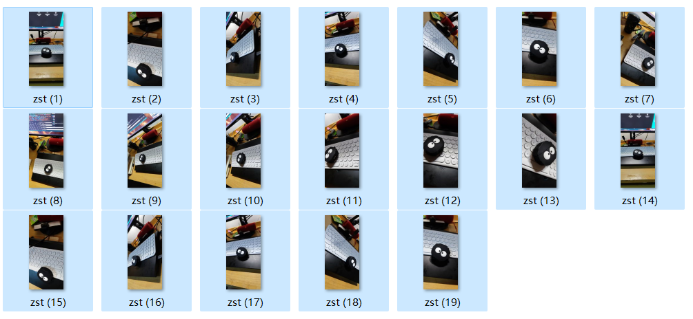
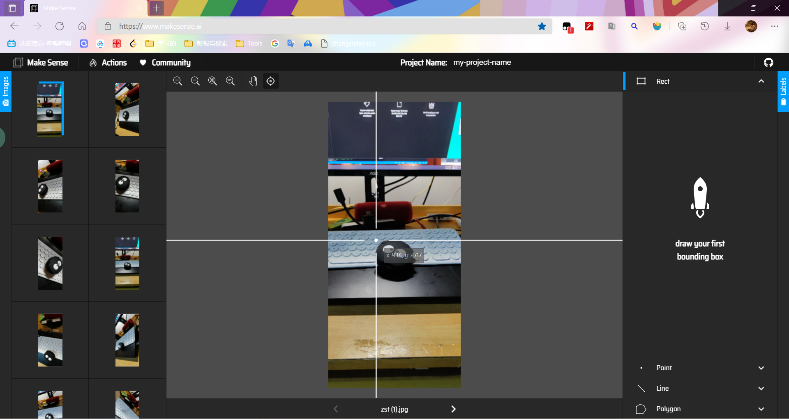
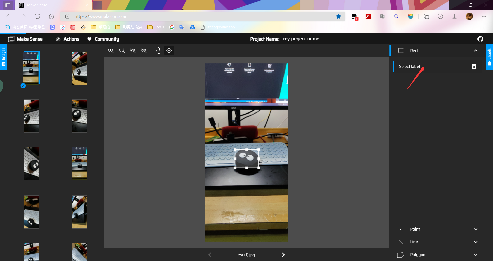
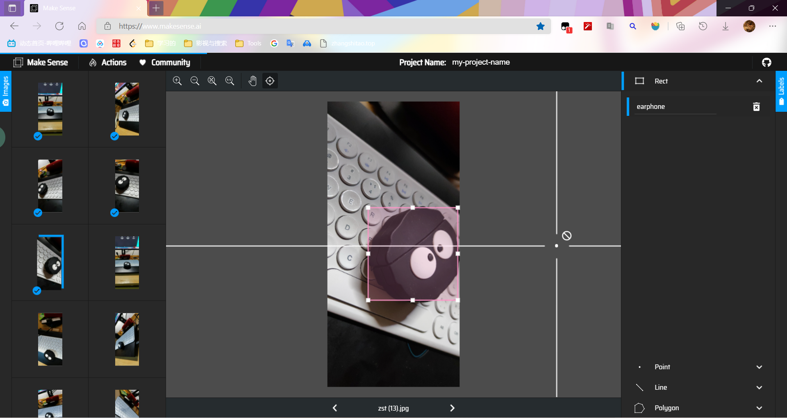
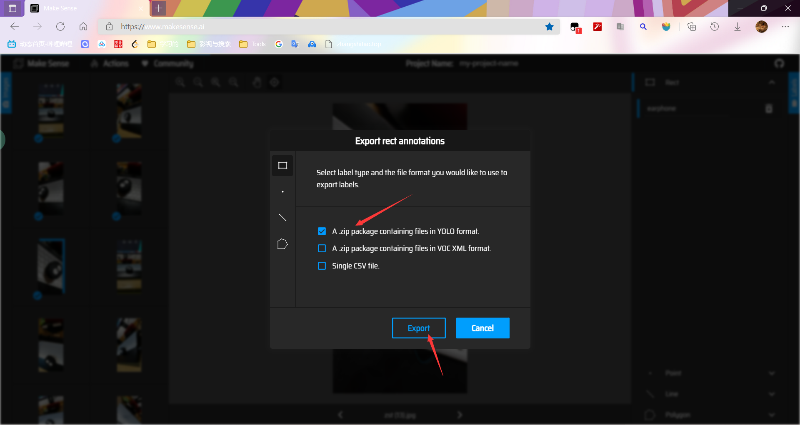
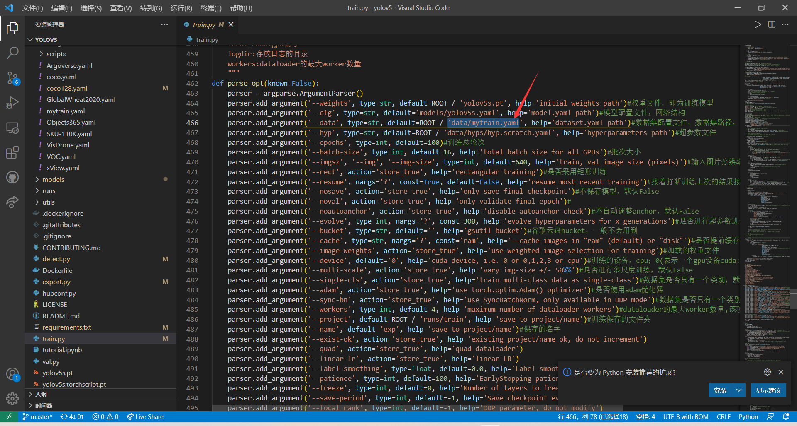

该章说明如何自定义数据集并开始训练然后用摄像头识别。
效果:

<div class="bilibili">
    <iframe src="//player.bilibili.com/player.html?aid=463827422&bvid=BV1yL411g7su&cid=433017095&page=1&high_quality=1" 
    scrolling="no" border="0" frameborder="no" framespacing="0" allowfullscreen="true"> </iframe>
</div>

## 拍摄照片

​	拍摄**不同环境，不同角度，不同距离**下的目标物体照片，注意拍摄目标**物体被遮挡**一部分的照片。简而言之，尽可能拍摄物体现实中会出现的所有情况的照片。

## 标定

​	通过网站 https://www.makesense.ai/ 进行目标的标定。

###  添加照片

​	首先在与yolo根目录的上级目录datasets目录下新建一个文件夹mytrain，并新建images和labels两个文件夹。将拍摄的照片原图重命名（若文件丢失方便定位）并移动到images目录下。

​	Tips: Windows下批量重命名照片。首先全选需要改名的照片，将第一个改为name，回车，就会发现照片全部重命名为name(i)，i从1开始。若将第一个改为name(i)，则后续名称为name(i+n)，即i从i开始（该方法适合后续添加照片）。



### 标定

打开标定网站，将照片拖入网站，选择object detection。


​	划区目标物体，以耳机盒为例。尽可能将其正好框在区域内。



​	添加一个标签，该标签是最终检测时会呈现的名字，所以必须统一，尽量简短。



​	以同样的方法将所有照片进行标定，最后注意检查是否所有照片都已经标定，所有标签都已打好。

​	如果需要标定多个物体，以上述同样方法操作。



​	标定完成之后，即可导出.


​	导出为yolo支持的格式。



​	导出的文件中为对应照片名字的txt文档，将其全部解压到2.1步骤中的labels文件夹。	

​	*至此我们新建的mytrain中的images中为训练的目标照片，labels中为这些照片对应的标定参数文件，数据集建立完成。*

## 修改配置文件并开始训练

### 在data中创建mytrain.yaml文件

输入以下内容：

```python
path: ../datasets/mytrain  # dataset root dir

train: images # 

val: images # 

/# Classes

nc: 1  #物体类别个数

names: ['earphone']  # 物体类别名称，与标定名称保持一致
```

### 修改train.py中cfg参数

修改为3.1创建的文件路径



### 开始训练


## 使用摄像头识别

todo
