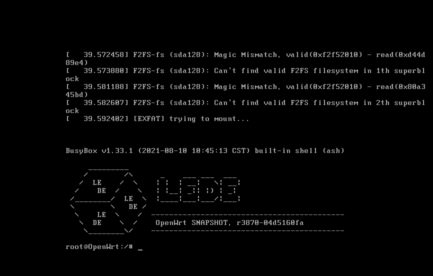

# 制作启动盘  
 将U盘制作为启动盘，推荐使用[微PE](https://www.wepe.com.cn/)。  
 将.img镜像文件与[DiskImage](https://xiazai.zol.com.cn/detail/47/463286.shtml)拷入U盘。

# 进入PE  
 从U盘启动进入PE  
 注：不同机器进入BIOS方式不一样，一般是按F12或DELETE，选择自己的U盘启动，不清楚可以百度如何U盘启动，教程很多，不赘述  

# 写盘  
* 打开diskimage  
* 选择要写的硬盘和镜像
* 完成后关机拔下U盘重启机器（重启之前我们可以接上显示器，以便观察是否写盘和启动成功）

# 设置
* 正常情况下重启机器后屏幕会输出命令行提示系统正在启动，若干秒后按回车即可用命令行控制，说明安装成功，否则可以尝试再次写盘或者查找其他原因  
     
   不同固件的初始IP以及登录用户名及密码可能都有区别，可以使用`vi /etc/config/network` 查看或者编辑初始ip  
   注：按ESC，再输入`:wq`可退出编辑  

* 用网线连接LAN1口与电脑  

  openwrt初始时默认LAN1口为lan，LAN2为wan，具体也可能因硬件有差异，一个不行就连另一个。

  浏览器输入192.168.1.1（初始IP）  

  如果能打开路由器登陆页面，那么恭喜你，软路由已经安装成功了。  

* 将外网网线连接到wan口  

  找到接口项，初始的接口除了wan、lan还会有docker等其他接口，我们用到的就wan和lan，其余可以删除（需要时也可以添加），**但是lan口万万不能删除，会导致进不了路由器管理，只能重装！！！**  

  修改wan口配置，选择PPPoe模式，物理设置中选择出lan的另一项网络适配器（双网口的选另一个，两个以上的可能需要看情况选择）。  
  
    
  注 ：由于我启用了多拨，所以会多出几个vwan虚拟网口。  
  应用设置，如果wan口获取到了ip，那就能上网了，可以打开[网站](http://xingfa.org/)检查一下，如果没有Ip，可以尝试换个网口（两个网口以上）或者检查一下账号密码等设置。  

# 健康上网  
 将路由器设置为桥接，连接到软路由的lan口。  

 其中插件的奥秘就各位自行体会了。

