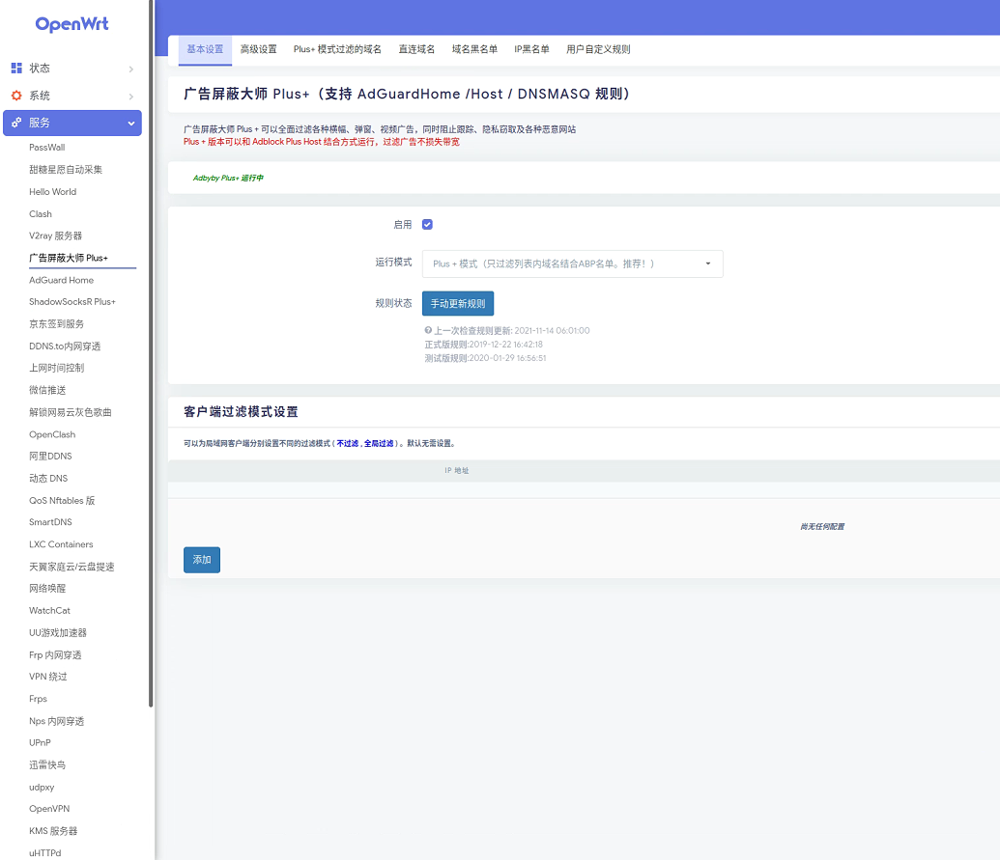

软路由也是一个路由器，不同的是，软路由赋予用户更多的权限，更多的插件以及更好的体验。我们日常使用的路由器可以说是一个精简版的软路由，它只提供了广域网、局域网等设置，并且能将信号通过天线广播出去。软路由一般不提供广播信号的功能，需要在LAN口连接一个路由器来做桥接和WIFI信号广播。但是它除了广域网、局域网的设置，还为我们提供了去广告等一系列插件，还有Docker供我们安装其他的插件，最最特别的还是软路由的固件可以我们自己编译，需要什么功能就添加，客制化我们自己的固件。  

# 硬件准备  
* 电脑  
* 网线  
* 能运行linux的硬件平台（有两个及以上网口）  
* U盘
* [镜像文件](https://github.com/xiaoqingfengATGH/HomeLede)

