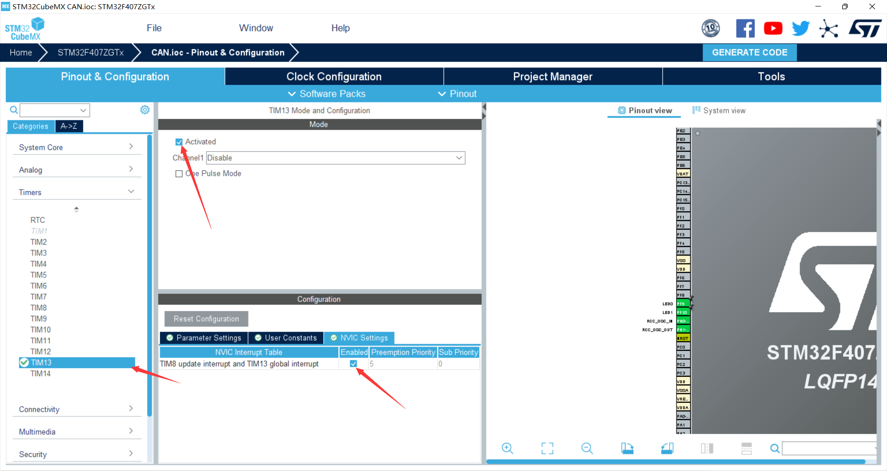
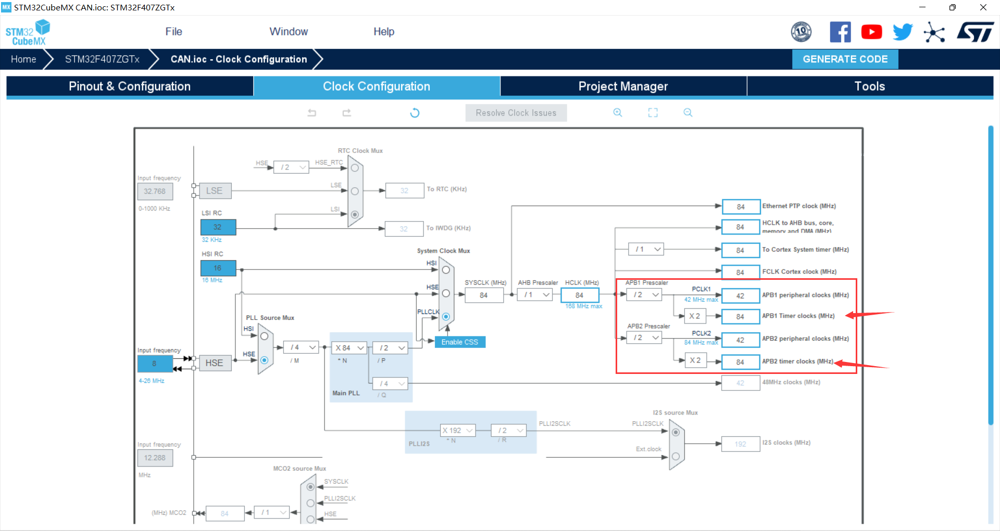
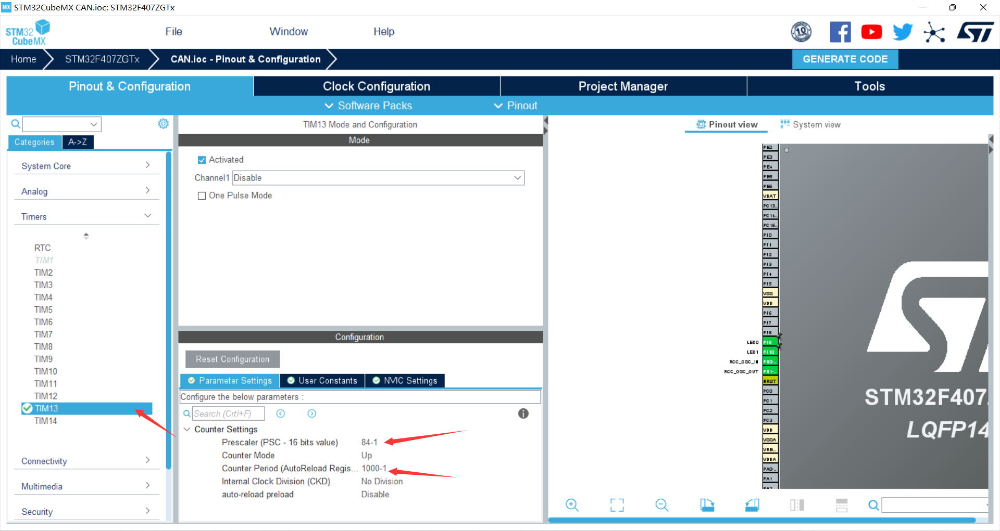

:::info
硬件：STM32F407开发板，CAN调试器，ST—LINK调试器
:::

目的是配置一个1ms定时器。  

## 时钟源  

### 选择定时器  
由于该定时器只需要定时1ms，没有其他的功能需求，选择普通定时器即可。例如STM32F4 的定时器有 TIME1 和 TIME8 等高级定时器，也有 TIME2~TIME5，TIM9~TIM14 等通用定时器，还有 TIME6 和 TIME7 等基本定时器，总共达 14 个定时器之多。  
在此，我们选择TIM13。使能之后打开中断  
   

### 配置定时时间  
根据手册判断定时器的时钟源是APB1还是APB2  
该工程TIM13时钟源为APB1，为84MHz。  
  

```
定时时间计算公式为 
Tout= ((arr+1)*(psc+1))/Tclk
Tclk：输入时钟频率（单位为 Mhz）
Tout：溢出时间（单位为 us）
arr：自动重装值
psc：时钟预分频数 
```

**若定时时间为1ms，那么  
1000=((arr+1)*(psc+1))/84  
psc=84-1（84分频为1MHz，即定时器频率为1MHz）  
arr=1000-1（重装值，计数每满1000次产生一次中断）即可**  
  
