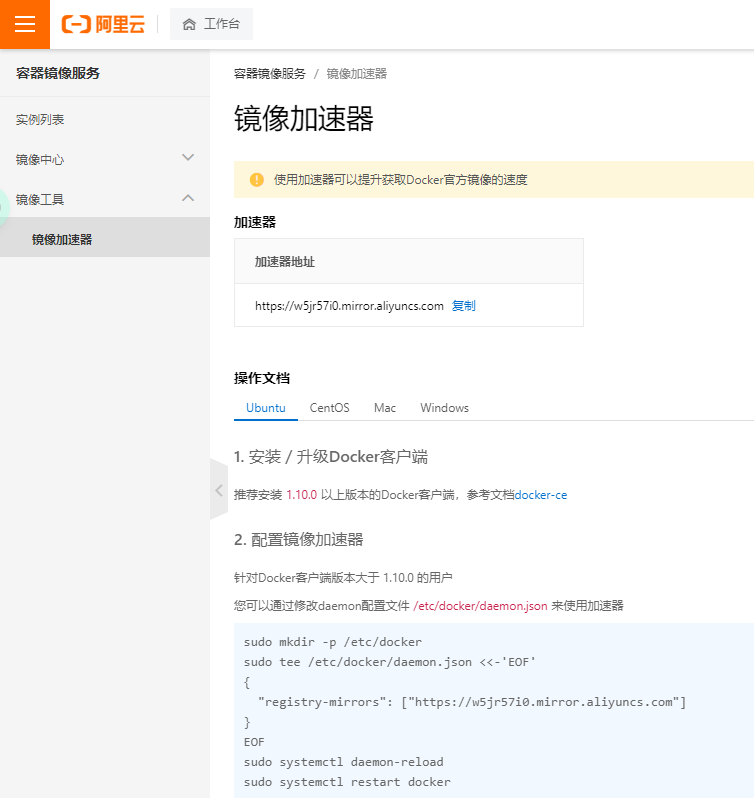

# 阿里云镜像加速
* 阿里云后台
* 容器镜像加速
* 按照提示添加命令  
 

# Docker命令
## 基本命令
```shell
docker version          #查看docker的版本信息
docker info             #查看docker的系统信息,包括镜像和容器的数量
docker 命令 --help       #帮助命令(可查看可选的参数)
docker COMMAND --help
```
## 镜像命令
### 查看本地主机的所有镜像
```shell
[root@z ~]# docker images
REPOSITORY    TAG       IMAGE ID       CREATED         SIZE
hello-world   latest    bf756fb1ae65   11 months ago   13.3kB
#解释:
1.REPOSITORY  镜像的仓库源
2.TAG  镜像的标签
3.IMAGE ID 镜像的id
4.CREATED 镜像的创建时间
5.SIZE 镜像的大小

#可选参数
-a/--all 列出所有镜像
-q/--quiet 只显示镜像的id
```

### 搜索镜像
```shell
[root@z ~]# docker search mysql
NAME                              DESCRIPTION                                     STARS     OFFICIAL   AUTOMATED
mysql                             MySQL is a widely used, open-source relation…   10308     [OK]
mariadb                           MariaDB is a community-developed fork of MyS…   3819      [OK]
mysql/mysql-server                Optimized MySQL Server Docker images. Create…   754                  [OK]
percona                           Percona Server is a fork of the MySQL relati…   517       [OK]
centos/mysql-57-centos7           MySQL 5.7 SQL database server                   86
mysql/mysql-cluster               Experimental MySQL Cluster Docker images. Cr…   79
centurylink/mysql                 Image containing mysql. Optimized to be link…   60                   [OK]


#可选参数

Search the Docker Hub for images

Options:
  -f, --filter filter   Filter output based on conditions provided
      --format string   Pretty-print search using a Go template
      --limit int       Max number of search results (default 25)
      --no-trunc        Don't truncate output
      
      
#搜索收藏数大于3000的镜像
[root@z ~]# docker search mysql --filter=STARS=3000
NAME      DESCRIPTION                                     STARS     OFFICIAL   AUTOMATED
mysql     MySQL is a widely used, open-source relation…   10308     [OK]
mariadb   MariaDB is a community-developed fordockerk of MyS…   3819      [OK]
```
### 下载镜像
```shell
[root@z ~]# docker pull mysql
Using default tag: latest            #如果不写tag默认就是latest
latest: Pulling from library/mysql
6ec7b7d162b2: Pull complete          #分层下载,docker image的核心-联合文件系统
fedd960d3481: Pull complete
7ab947313861: Pull complete
64f92f19e638: Pull complete
3e80b17bff96: Pull complete
014e976799f9: Pull complete
59ae84fee1b3: Pull complete
ffe10de703ea: Pull complete
657af6d90c83: Pull complete
98bfb480322c: Pull complete
6aa3859c4789: Pull complete
1ed875d851ef: Pull complete
Digest: sha256:78800e6d3f1b230e35275145e657b82c3fb02a27b2d8e76aac2f5e90c1c30873 #签名
Status: Downloaded newer image for mysql:latest
docker.io/library/mysql:latest  #下载来源的真实地址  #docker pull mysql等价于docker pull docker.io/library/mysql:latest
#指定版本下载
[root@z ~]# docker pull mysql:5.7
5.7: Pulling from library/mysql
6ec7b7d162b2: Already exists
fedd960d3481: Already exists
7ab947313861: Already exists
64f92f19e638: Already exists
3e80b17bff96: Already exists
014e976799f9: Already exists
59ae84fee1b3: Already exists
7d1da2a18e2e: Pull complete
301a28b700b9: Pull complete
529dc8dbeaf3: Pull complete
bc9d021dc13f: Pull complete
Digest: sha256:c3a567d3e3ad8b05dfce401ed08f0f6bf3f3b64cc17694979d5f2e5d78e10173
Status: Downloaded newer image for mysql:5.7
docker.io/library/mysql:5.7
```

### 删除镜像
```shell
#1.删除指定的镜像id
[root@z ~]# docker rmi -f  镜像id
#2.删除多个镜像id
[root@z ~]# docker rmi -f  镜像id 镜像id 镜像id
#3.删除全部的镜像id
[root@z ~]# docker rmi -f  $(docker images -aq)
```

## 容器命令

### 拉取一个容器

```shell
docker pull centos #centos为例
```

### 运行容器

```shell
docker run [可选参数] image

#参数说明
--name="名字"           指定容器名字
-d                     后台方式运行
-it                    使用交互方式运行,进入容器查看内容
-p                     指定容器的端口
(
-p ip:主机端口:容器端口  配置主机端口映射到容器端口
-p 主机端口:容器端口
-p 容器端口
)
-P                     随机指定端口(大写的P)
```

### 进入容器

```shell
[root@z ~]# docker run -it centos /bin/bash
[root@z /]# ls      
bin  dev  etc  home  lib  lib64  lost+found  media  mnt  opt  proc  root  run  sbin  srv  sys  tmp  usr  var
```

### 退出容器

```shell
#exit 停止并退出容器（后台方式运行则仅退出）
#Ctrl+P+Q  不停止容器退出
[root@z /]# exit
exit
[root@z ~]#
```

### 列出运行过的容器

```shell
#docker ps 
     # 列出当前正在运行的容器
-a   # 列出所有容器的运行记录
-n=? # 显示最近创建的n个容器
-q   # 只显示容器的编号


[root@z ~]# docker ps
CONTAINER ID   IMAGE     COMMAND   CREATED   STATUS    PORTS     NAMES
[root@z ~]# docker ps -a
CONTAINER ID   IMAGE          COMMAND       CREATED         STATUS                     PORTS     NAMES
bca129320bb5   centos         "/bin/bash"   4 minutes ago   Exited (0) 3 minutes ago             optimistic_shtern
z   centos         "/bin/bash"   6 minutes ago   Exited (0) 5 minutes ago             cool_tesla
cf6adbf1b506   bf756fb1ae65   "/hello"      5 hours ago     Exited (0) 5 hours ago               optimistic_darwin
```

### 删除容器

```shell
docker rm 容器id                 #删除指定的容器,不能删除正在运行的容器,强制删除使用 rm -f
docker rm -f $(docker ps -aq)   #删除所有的容器
docker ps -a -q|xargs docker rm #删除所有的容器
```

### 启动和停止容器

```shell
docker start 容器id          #启动容器
docker restart 容器id        #重启容器
docker stop 容器id           #停止当前运行的容器
docker kill 容器id           #强制停止当前容器
docker stop $(docker ps -a -q) 	#停止所有容器
```


