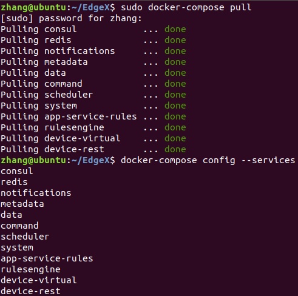
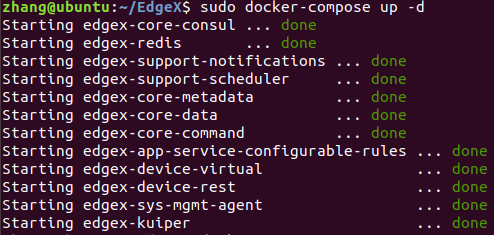
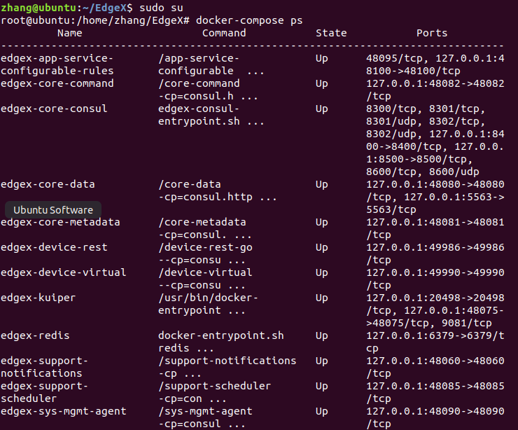
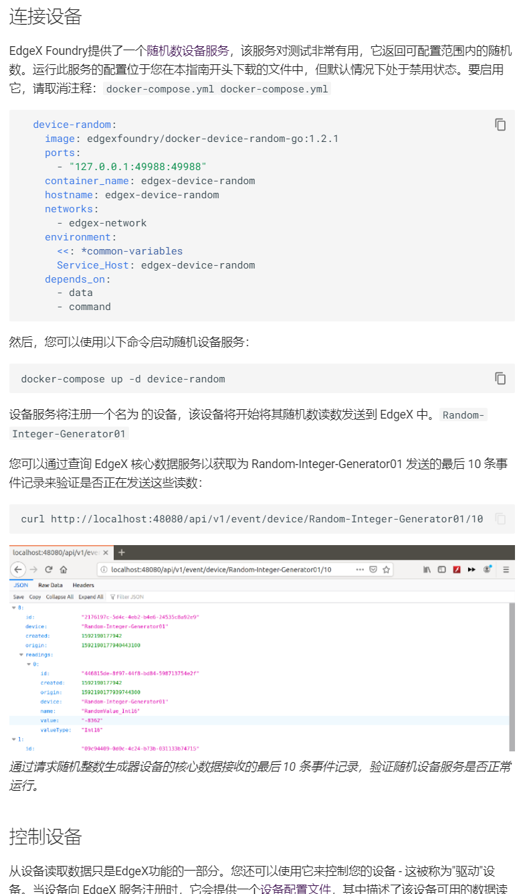
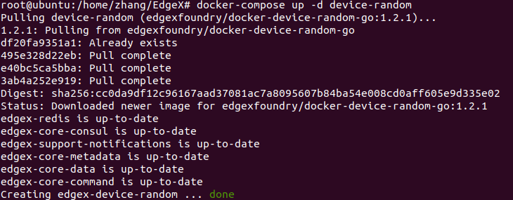
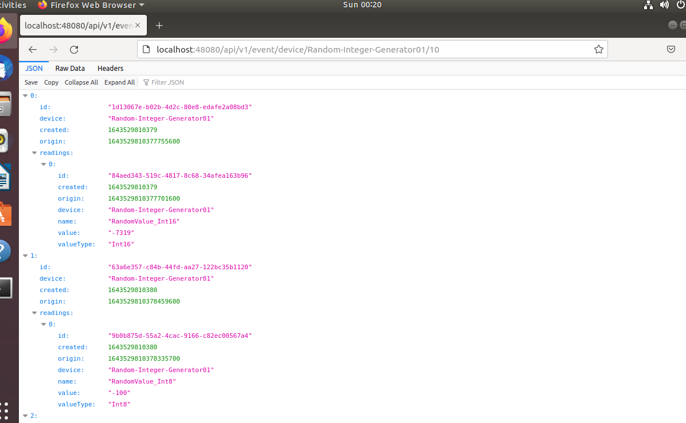
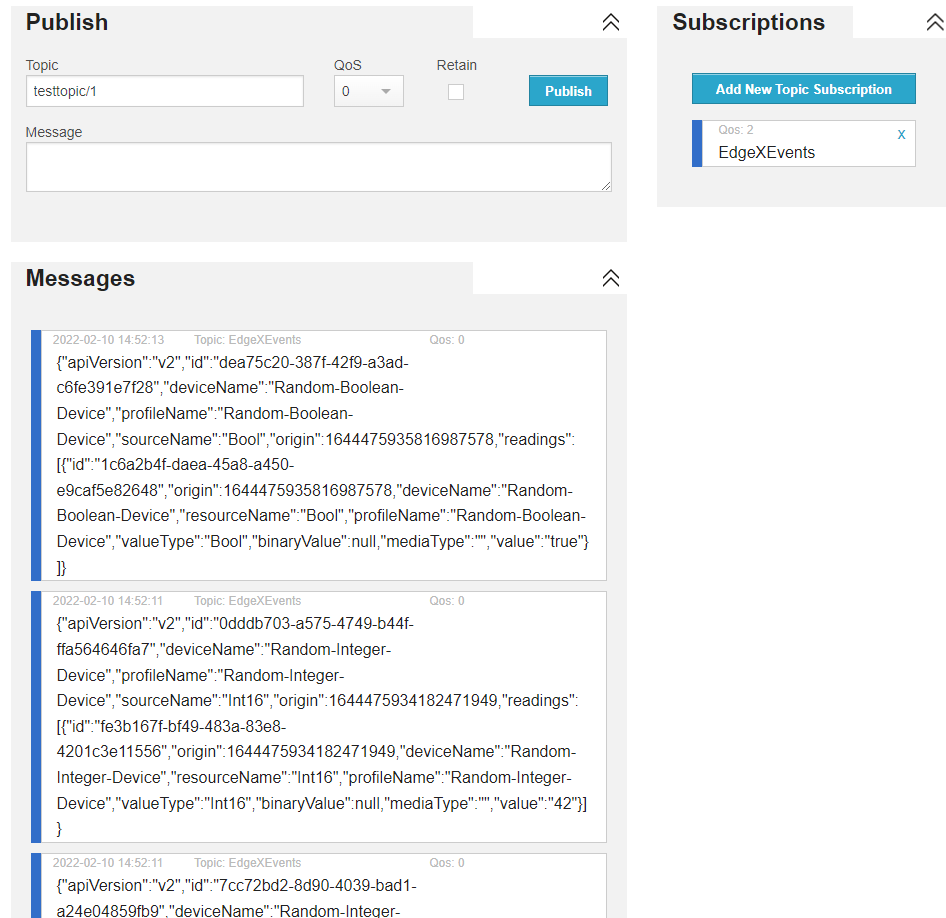

:::info

平台：UBUNTU18.04 LTS

该篇说明了开发者初期快速运行体验edgex，以便了解功能等

:::


参考资料：

* [EdgeX Foundry 快速熟悉](https://www.jianshu.com/p/e48dbd087133)
* [EdgeX Foundry快速入门](https://docs.edgexfoundry.org/1.2/getting-started/quick-start/)

## 安装Docker以及Dokcer-compose

参照上一节

## 启动EdgeX

```c++
mkdir  ~/EdgeX && cd  ~/EdgeX
curl https://raw.githubusercontent.com/edgexfoundry/edgex-compose/jakarta/docker-compose-no-secty.yml -o docker-compose.yml	# 下载compose文件
docker-compose up -d
```
```shell
# Q:若提示Failed to connect to raw.githubusercontent.com port 443: Connection refused
# A:将DNS设置为8.8.8.8
```

```shell
sudo docker-compose pull	#下载edgex相关代码
docker-compose config --services	# 获取Docker Compose名称列表
sudo docker-compose up -d #后台运行
```




## 检查验证服务

```shell
docker-compose ps  #验证 EdgeX 容器是否已启动
```


### [快速入门](https://docs.edgexfoundry.org/1.2/getting-started/quick-start/)中随机设备服务验证



取消注释后启动服务

```shell
docker-compose up -d device-random
```


