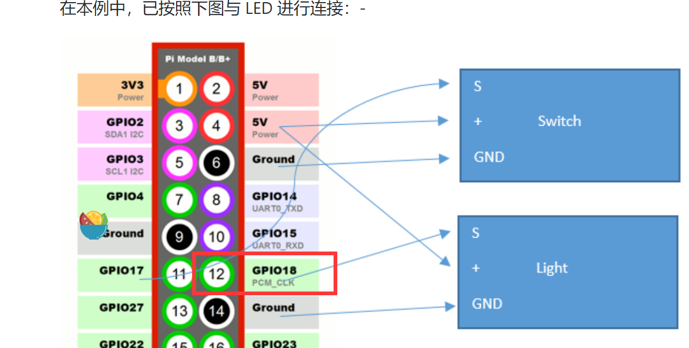
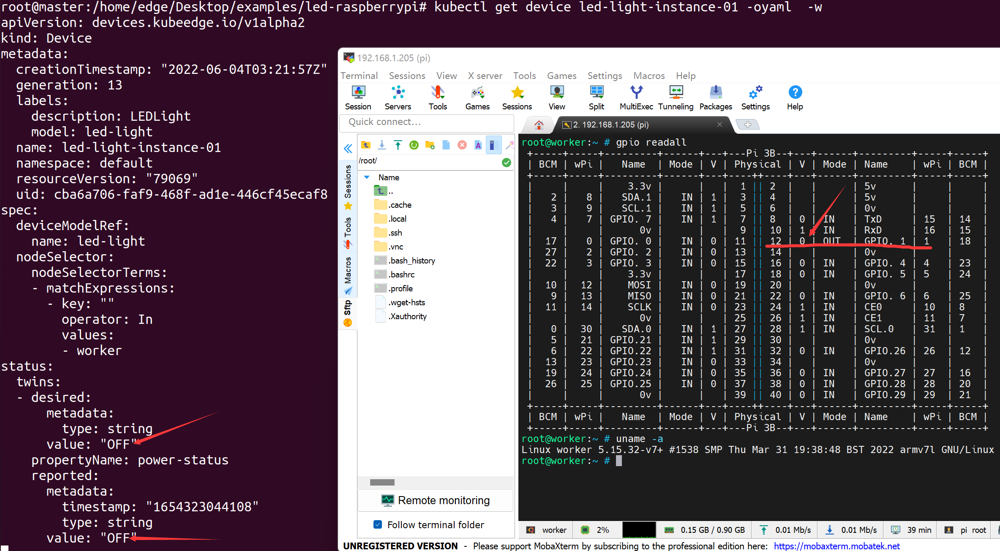

:::info

|    master     |     worker     |
| :-----------: | :------------: |
| 192.168.1.200 | 192.168.1.205  |
|  ubuntu20.04  | raspberryPi 3B |

:::

:::warning

**注意：实例必须在模型之后创建，在模型之前删除。即先创建model再创建instance，先删除instance在删除model**

:::

## 仓库

~~~shell
git clone https://github.com/kubeedge/examples/tree/master/led-raspberrypi
~~~

## 修改

修改instance.yaml中nodename为需要调度的节点名称

~~~yaml
spec:
  deviceModelRef:
    name: led-light
  nodeSelector:
    nodeSelectorTerms:
    - matchExpressions:
      - key: ''
        operator: In
        values:
        - worker
~~~

## 编译

直接编译的镜像为amd64位版本，不可再arm架构上使用，使用

~~~shell
uname -a
~~~

查看系统架构

* 如果为x86直接使用`make`命令编译即可，同时还会执行`docker build`编译镜像。

* 如果为arm，则

  1. 修改Dockerfile，替换基础镜像

     ~~~shell
     # FROM ubuntu:latest
     FROM latelee/busybox-arm:latest
     CMD mkdir -p light_mapper
     COPY . light_mapper/
     WORKDIR light_mapper
     ENTRYPOINT ["/light_mapper/light_mapper","-logtostderr=true"]
     ~~~

  2. ~~~shell
     export GOARCH=arm; export GOOS="linux"; export GOARM=7; export CGO_ENABLED=1; export CC=arm-linux-gnueabihf-gcc;
     go build light_mapper.go
     docker buildx build -t 16hz/led-light-mapper:v1.1 --platform=linux/arm . --push --no-cache	#如果不需要推送到镜像仓库则去掉--push命令
     ~~~

     ~~~shell
     file light_mapper	# 查看make后的文件属性，确认该文件在amd还是arm环境运行
     ~~~

## 部署

依次执行

~~~shell
kubectl apply -f led-light-device-model.yaml
kubectl apply -f led-light-device-instance.yaml
kubectl create -f deployment.yaml
~~~

## 结果

## 验证

由于没有LED，所以直接观察树莓派引脚电平变化判断操作是否有效，观察引脚为12号脚

* 安装wiringPi以查看gpio

  ~~~shell
  //克隆库
  git clone https://github.com/WiringPi/WiringPi.git
  //进入文件夹
  cd wiringPi
  //编译安装
  ./build
  gpio readall	#获取所有gpio状态
  ~~~

* 当期望值为off时，引脚输出为0v

* 手动修改期望值为on时，引脚输出为5v
